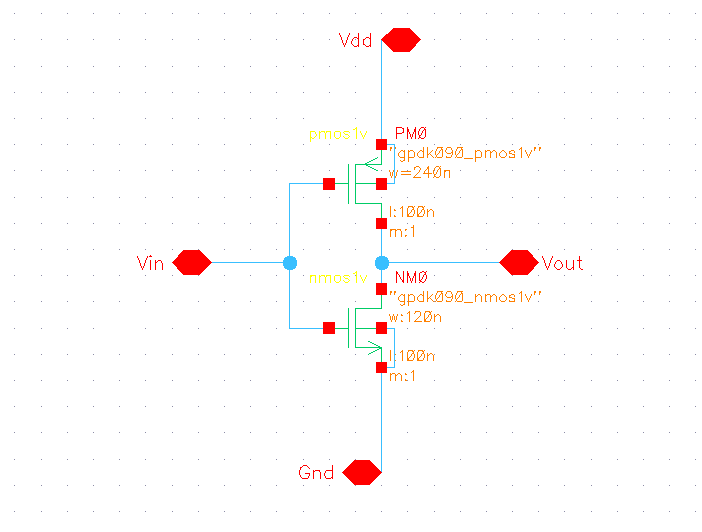
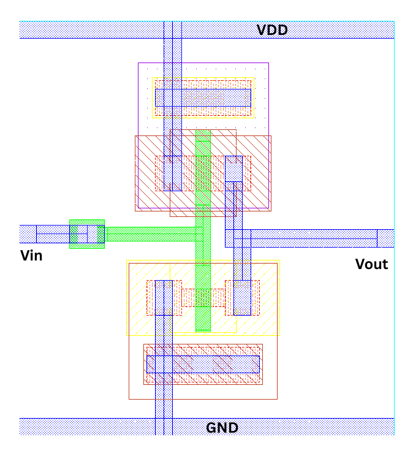
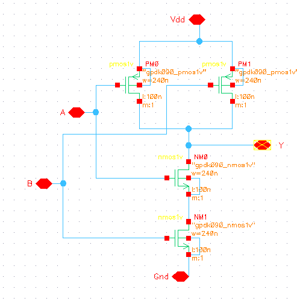
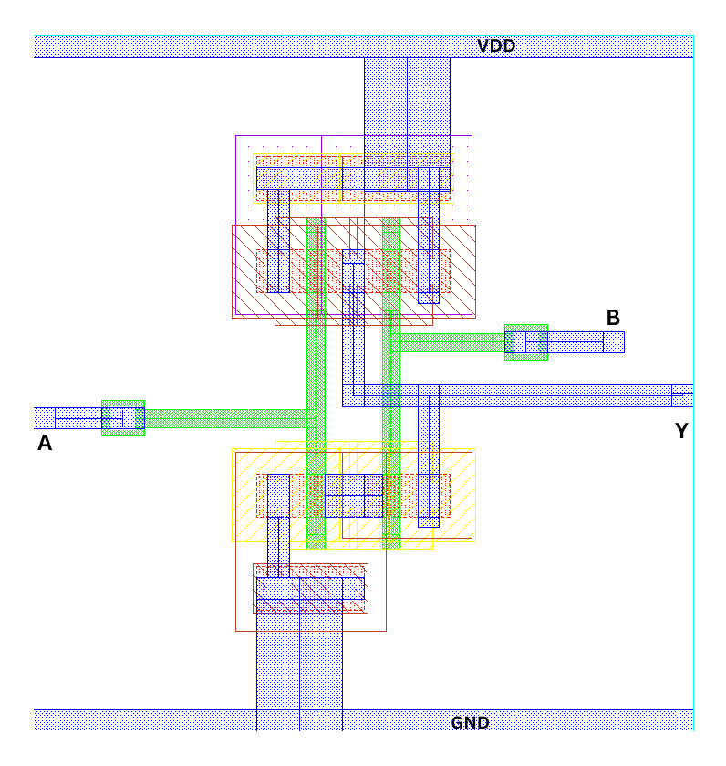
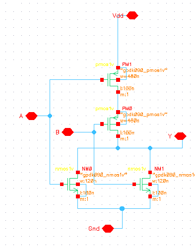
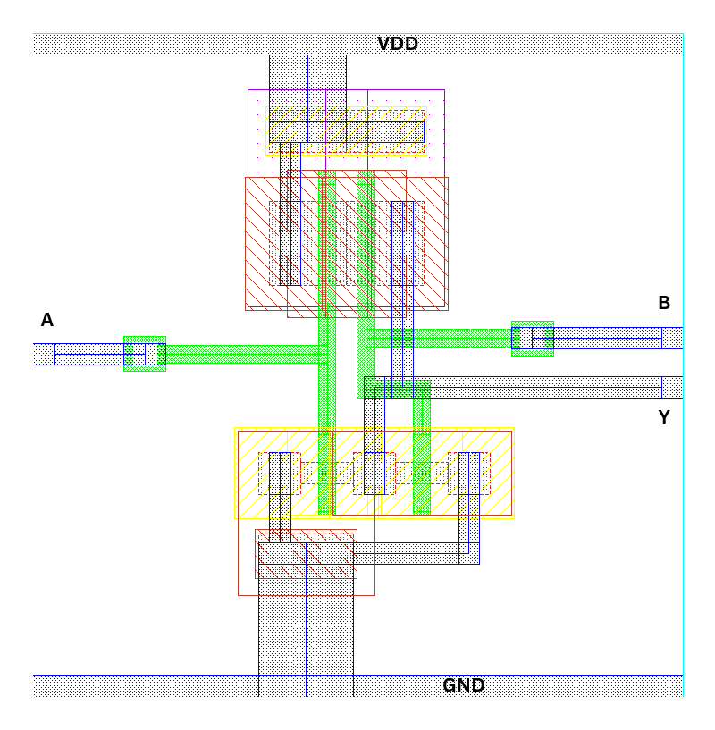
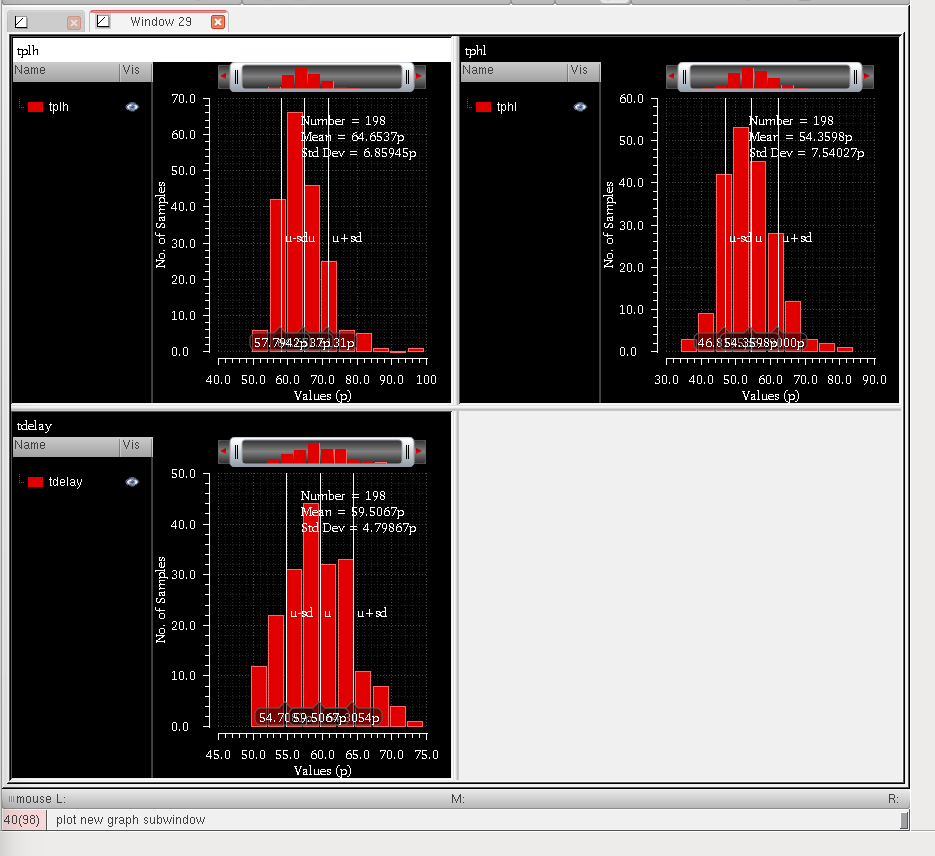
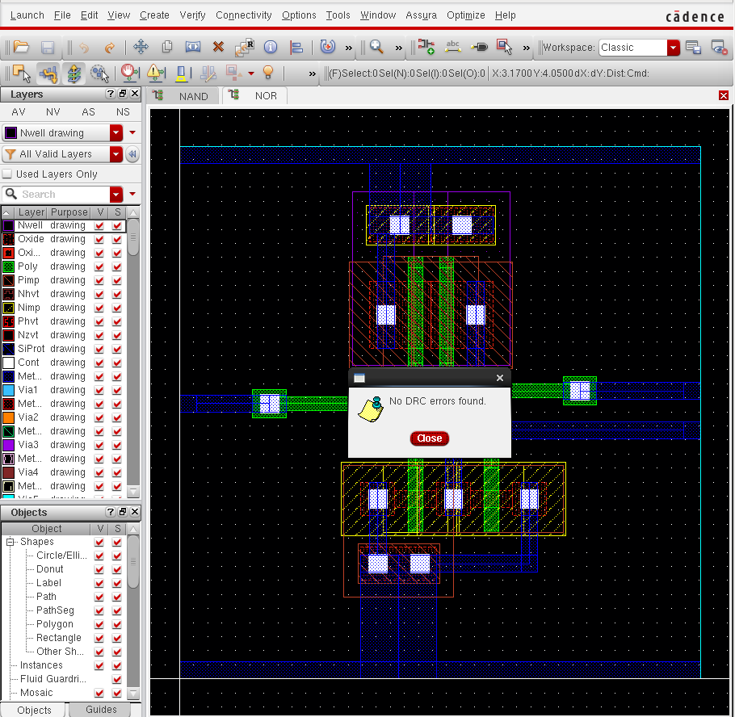
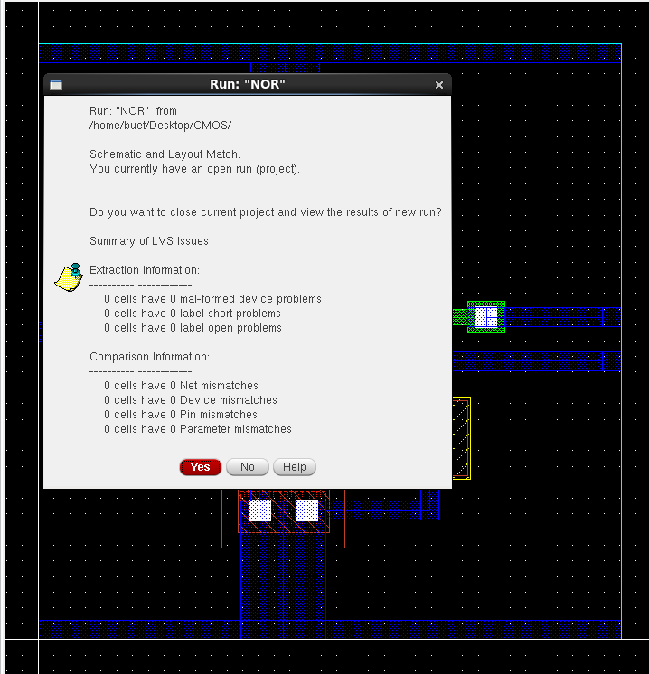

# CMOS-Standard-Cell-Design-Layout-and-Characterization
# CMOS Standard Cell Design and Characterization

## Overview

This project presents the transistor-level design, full-custom layout, and
performance characterization of basic CMOS standard cells using a 90 nm CMOS
technology.

The following cells were designed and evaluated:

- CMOS Inverter
- 2-input NAND (NAND2)
- 2-input NOR (NOR2)

The project follows a complete custom IC design flow from schematic design and
pre-layout simulation through physical layout, DRC/LVS verification,
parasitic extraction, and post-layout characterization.

---

## Design Flow

**Specification → Transistor Sizing → Schematic Design → Pre-Layout Simulation
→ Full-Custom Layout → DRC → LVS → Parasitic Extraction
→ Post-Layout Simulation**

---

## 1. CMOS Inverter

The CMOS inverter was designed as the baseline cell for timing, power,
process-variation, and post-layout analysis.

### Schematic



### Layout



---

## 2. 2-Input NAND

The NAND2 gate uses a series NMOS pull-down network and parallel PMOS
pull-up network.

### Schematic



### Layout



---

## 3. 2-Input NOR

The NOR2 gate uses a parallel NMOS pull-down network and series PMOS
pull-up network. PMOS sizing was increased to compensate for the
series pull-up path.

### Schematic



### Layout



---

## Characterization

Propagation delay was characterized using transient simulations for both
pre-layout and extracted post-layout views.

The average propagation delay was calculated as:

$$
t_{pd} = \frac{t_{pHL}+t_{pLH}}{2}
$$

### Pre-Layout vs Post-Layout Results

| Cell | Pre-Layout Avg. Delay | Post-Layout Avg. Delay | Delay Increase |
|------|----------------------:|-----------------------:|---------------:|
| Inverter | 58.13 ps | 59.73 ps | 2.75% |
| NAND2 | 57.11 ps | 59.27 ps | 3.78% |
| NOR2 | 63.57 ps | 64.44 ps | 1.37% |

Post-layout simulations showed a modest increase in propagation delay due
to parasitic resistance and capacitance introduced by the physical layout.

---

## Process Variation

A 200-run Monte Carlo simulation was performed on the CMOS inverter to
evaluate the effect of process variation on propagation delay.



---

## Process Corner Analysis

The CMOS inverter was additionally evaluated under the Slow-Slow (SS)
process corner to assess performance under reduced device drive strength.


---

## Physical Verification

### Design Rule Check (DRC)

The layouts were verified against the technology design rules.



### Layout Versus Schematic (LVS)

LVS verification was performed to ensure correspondence between the
schematic and physical implementation.



---

## Key Results

- Designed and characterized CMOS Inverter, NAND2, and NOR2 cells at the
  transistor level.
- Completed full-custom physical layouts for all three cells.
- Achieved DRC-clean and LVS-matched layouts.
- Performed parasitic extraction and post-layout timing characterization.
- Observed only **~1–4% increase in propagation delay** after layout
  parasitics across the three cells.
- Performed **200-run Monte Carlo analysis** on the CMOS inverter to
  evaluate process-induced timing variation.
- Evaluated the CMOS inverter under the **SS process corner**.

---

## Technology and Tools

| Category | Technology / Tool |
|----------|-------------------|
| Technology | GPDK90, 90 nm CMOS |
| Design Environment | Cadence Virtuoso |
| Circuit Simulation | Cadence Spectre |
| Analysis | Transient, Monte Carlo, Process Corner |
| Physical Verification | DRC, LVS |
| Parasitic Extraction | PEX |

---

## Repository Structure

```text
custom-cmos-standard-cells/
│
├── README.md
│
└── images/
    ├── inverter_schematic.png
    ├── nand2_schematic.png
    ├── nor2_schematic.png
    ├── inverter_layout.png
    ├── nand2_layout.png
    ├── nor2_layout.png
    ├── monte_carlo_inverter.png
    ├── ss_inverter.png
    ├── drc_pass.png
    └── lvs_pass.png
